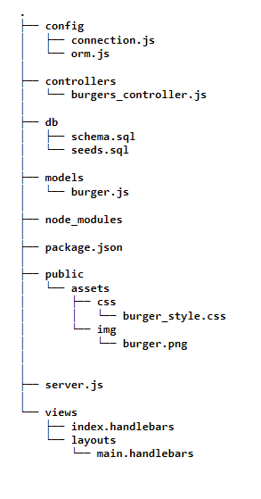
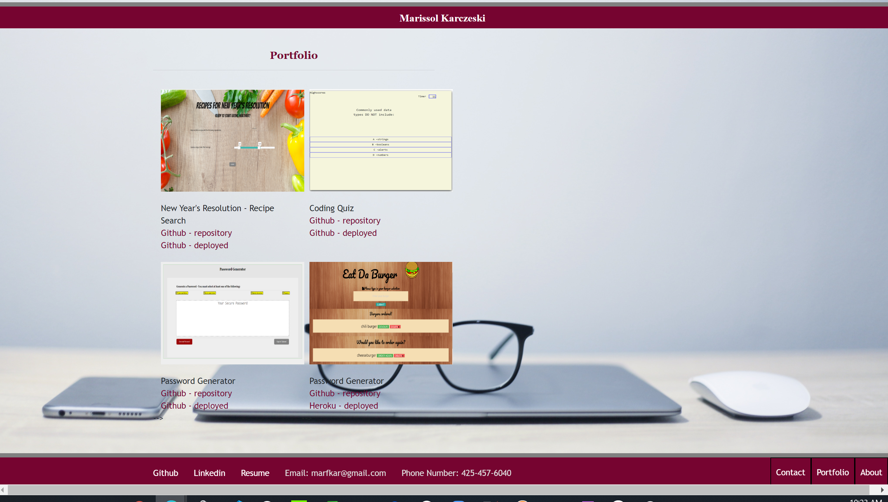

# Burger (Node Express-handlebars)
Homework 13

## Instructions
This app is from a restaurant named Eat-Da-Burger that allows the user to choose the type of burger they want to eat. There can be more than one choice and it can be saved (DEVOUR IT!!!) or their choice can be removed by clicking on "delete".The user may add more burgers by clicking on the button "order again." Each burger added will be stored in a database.

## Technologies
- MySQL
- Node
- Express
- Handlebars
- ORM
- Heroku - deployment

## Directory structure

# Heroku deployment and Github 

https://burger-heroku-app.herokuapp.com/

https://solka2019.github.io/Burger/.

https://github.com/solka2019/Burger

### Link to  my Portfolio - screenshot

